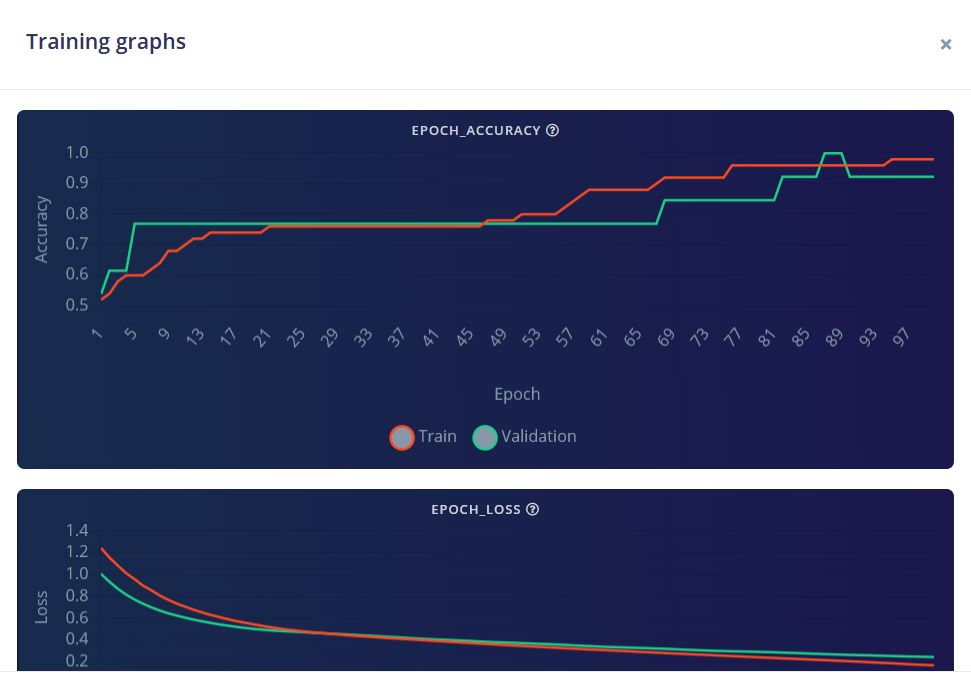
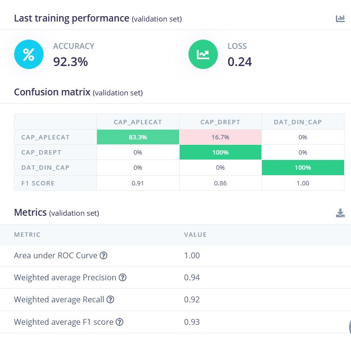
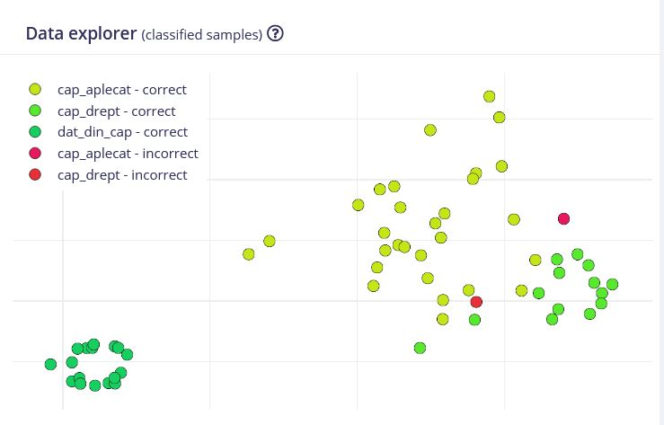

# Posture Coach — Wearable Edge-AI Posture Monitor

Posture Coach is a self-contained wearable that performs real-time head-posture
classification using a neural network deployed directly on an ESP32
microcontroller. All sensing, inference, and feedback are executed locally on the
device — it requires no cloud service, companion application, or network
connection. The sensor is mounted on a cap and continuously determines whether
the wearer is upright, slouching, or nodding, providing immediate feedback
through on-board indicators and a live Bluetooth dashboard.

Powered from a standard USB power bank, the device operates untethered as a
genuine wearable prototype.

This project was developed to gain practical experience across the full embedded
machine-learning workflow: motion sensing and sensor fusion, on-device (TinyML)
inference, and the end-to-end path from raw data acquisition to a model running on
constrained hardware.

<!-- Add a photo of the assembled device here, e.g.: -->
<!--  -->

## System architecture

The system is organized into three cooperating subsystems:

- **Sensing.** An MPU6050 inertial measurement unit supplies six-axis motion
  data — a three-axis accelerometer and three-axis gyroscope — over I2C at 50 Hz.
- **Inference.** A neural network trained in Edge Impulse executes on-device via
  TensorFlow Lite for Microcontrollers, classifying two-second windows of motion
  into one of three posture states.
- **Feedback.** The predicted state drives physical indicators (LEDs and a buzzer
  through GPIO) and is transmitted over Bluetooth Low Energy to a browser-based
  dashboard implemented with the Web Bluetooth API.

## Classification targets

| Label | Description | Type |
|-------|-------------|------|
| `cap_drept` | Upright posture | Static |
| `cap_aplecat` | Slouching / downward head tilt | Static |
| `dat_din_cap` | Nodding | Dynamic gesture |

A green LED indicates good posture, while a red LED and buzzer indicate
slouching. Class labels are in Romanian, reflecting how the dataset was annotated
during collection.

## Machine-learning pipeline

1. **Data acquisition.** A dedicated firmware routine streams accelerometer and
   gyroscope readings over the serial interface in CSV format. Multiple
   twenty-second sessions were recorded per class, with the device worn as
   intended, to capture realistic variation.
2. **Feature extraction.** Each two-second window is transformed using spectral
   analysis, which separated the target classes more effectively than raw
   time-series input.

3. **Model training.** A neural-network classifier was trained in Edge Impulse.
   Because the raw sensor values are large in magnitude (accelerometer readings
   approaching +/-16000), input scaling was critical: without it, the training
   loss diverged and validation accuracy collapsed. With appropriately scaled
   inputs, training converged smoothly, with the validation curve tracking the
   training curve closely.

   

4. **Evaluation.** The model reaches 92.3% accuracy on the validation set. The
   confusion matrix below shows that the dynamic nodding gesture is classified
   perfectly, while the two static postures are occasionally confused with one
   another — a limitation discussed in the final section.

   

   The feature-space projection further illustrates this: the classes form
   distinct clusters, with only a few misclassified samples near the boundary
   between the two static postures.

   

5. **Deployment.** The trained model was exported as a quantized (int8) Arduino
   library — approximately 16 KB of flash with roughly 1 ms inference time — and
   runs entirely on the ESP32.
6. **Post-processing.** To suppress noise in the raw predictions, a lightweight
   debounce filter commits to a new posture only after it is observed across
   consecutive windows above a confidence threshold, trading a small amount of
   latency for substantially more stable output.

## Technology stack

- **Languages:** C/C++ (firmware); HTML, CSS, JavaScript (dashboard)
- **Machine learning:** Edge Impulse, TensorFlow Lite for Microcontrollers,
  spectral feature extraction, neural-network classification, int8 quantization
- **Embedded systems:** ESP32, MPU6050, I2C, GPIO control, Bluetooth Low Energy
- **Web:** Web Bluetooth API for real-time device-to-browser communication
- **Tooling:** Arduino IDE, Edge Impulse Studio

## Bill of materials

| Component | Description | Cost |
|-----------|-------------|--------------|
| [ESP32-DevKitC Board (WROOM-32D, 38P)](https://sigmanortec.ro/placa-dezvoltare-esp32-devkitc-esp32-wroom-32d-38p) | Main microcontroller with integrated BLE | ~9.00 USD (42.56 RON) |
| [MPU6050 (GY-521) Module](https://sigmanortec.ro/Modul-giroscopic-si-accelerometru-3-axe-GY-521-p126016326) | Six-axis accelerometer + gyroscope, I2C | ~5.20 USD (24.58 RON) |
| [Resistor & LED Kit](https://sigmanortec.ro/Kit-Rezistori-si-Potentiometre-A1-p141487466) | Used for the Red/Green LEDs and 100Ω resistors | ~3.30 USD (15.78 RON) |
| [Active Buzzer Module (5V)](https://sigmanortec.ro/Modul-buzzer-activ-p136261325) | Audible slouch alert (Active-Low) | ~0.80 USD (3.63 RON) |
| [400-Point Solderless Breadboard](https://sigmanortec.ro/Breadboard-400-puncte-p129872825) | Prototyping base for the wearable | ~1.40 USD (6.62 RON) |
| [Dupont Jumper Wires](https://sigmanortec.ro/40-fire-Dupont-10cm-Tata-Mama-p210855157) | Routing connections (Male-Male & Male-Female) | ~3.50 USD (16.56 RON) |
| USB power bank | Untethered portable power supply | Reused |

## Repository structure

| File | Description |
|------|-------------|
| `posture_inference.ino` | Main firmware: sensor acquisition, inference, filtering, LED/buzzer feedback, and BLE broadcast |
| `data_collection.ino` | Firmware used to stream training data over serial |
| `posture.html` | Web Bluetooth dashboard (Chrome or Edge only; the API is unsupported in Firefox and Safari) |
| `images/` | Photographs and training/evaluation figures |

## Getting started

1. Import the exported Edge Impulse Arduino library into the Arduino IDE.
2. Flash `posture_coach.ino` onto the ESP32.
3. Power the board from USB or a USB power bank.
4. Open `posture.html` in Chrome or Edge, click **Connect**, and select the
   `PostureCoach` device.

## Limitations and future work

The system functions end to end, and developing it clarified both its constraints
and the most valuable directions for improvement.

The principal limitation lies in distinguishing the two *static* postures —
upright and slouching — which occupy similar regions of the sensor feature space,
as each corresponds to a sustained tilt angle. As the confusion matrix shows, this
is where the model's errors concentrate, whereas the dynamic nodding gesture is
recognized reliably because the gyroscope makes motion straightforward to detect.
The most impactful improvement would be a larger and more deliberately separated
training set: additional sessions per class, with a more pronounced and consistent
distinction between the two static postures, would likely improve generalization
considerably more than any change to the model architecture itself.

A second area for improvement is the physical construction. The current prototype
is assembled on a breadboard with the ESP32 connected via discrete jumper wires,
which is mechanically fragile. A more robust revision would migrate the circuit to
a soldered protoboard or a custom PCB, yielding permanent and reliable connections.
The sensor is likewise temporarily affixed to the cap; mounting it on a small
dedicated board fixed to the cap would preserve a consistent orientation between
training and deployment — a factor that directly affects accuracy.

Further extensions include logging posture duration to generate a daily ergonomic
report, incorporating additional gestures to exploit the gyroscope more fully, and
integrating an onboard battery for a more refined untethered form factor.
